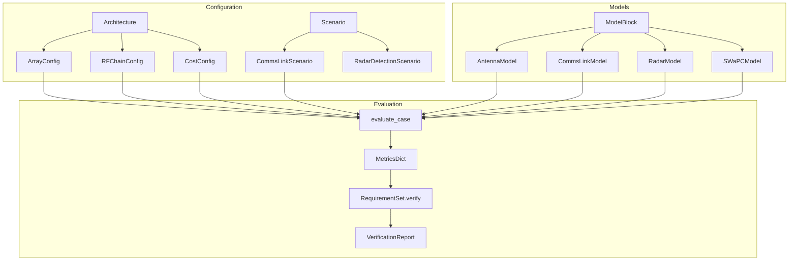
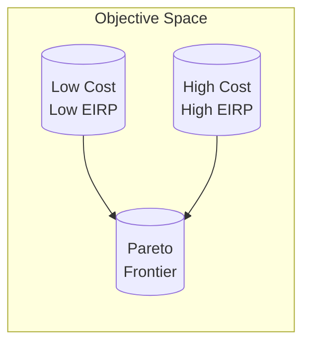
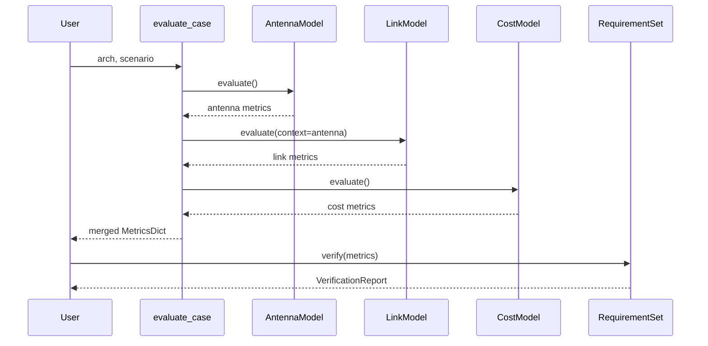
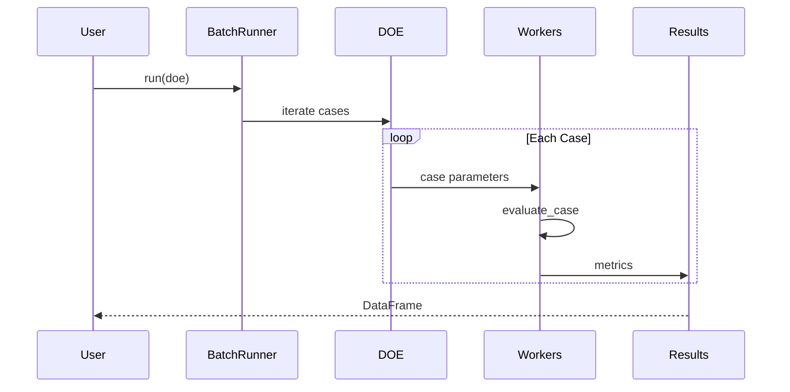

# Core Concepts

This page explains the key concepts and design patterns in phased-array-systems.

## Architecture Overview

The package is organized around a model-based systems engineering (MBSE) workflow:



## Key Abstractions

### Architecture

The `Architecture` class is the top-level configuration container. It holds all parameters describing a phased array system design.

```python
from phased_array_systems.architecture import Architecture, ArrayConfig, RFChainConfig

arch = Architecture(
    array=ArrayConfig(nx=8, ny=8, dx_lambda=0.5, dy_lambda=0.5),
    rf=RFChainConfig(tx_power_w_per_elem=1.0),
    name="My Design",
)
```

**Components:**

| Component | Description |
|-----------|-------------|
| `ArrayConfig` | Array geometry: dimensions, spacing, scan limits |
| `RFChainConfig` | RF parameters: TX power, efficiency, noise figure |
| `CostConfig` | Cost model: per-element cost, NRE, integration |

### Scenario

A `Scenario` defines the operating conditions for analysis. Different scenario types exist for different applications.

```python
from phased_array_systems.scenarios import CommsLinkScenario

scenario = CommsLinkScenario(
    freq_hz=10e9,
    bandwidth_hz=10e6,
    range_m=100e3,
    required_snr_db=10.0,
)
```

**Scenario Types:**

| Scenario | Use Case |
|----------|----------|
| `CommsLinkScenario` | Communications link budget analysis |
| `RadarDetectionScenario` | Radar detection performance |

### MetricsDict

All model outputs use a flat dictionary format for consistency and interoperability:

```python
metrics = {
    # Antenna metrics
    "g_peak_db": 25.0,
    "beamwidth_az_deg": 12.5,
    "sll_db": -13.0,

    # Link budget metrics
    "eirp_dbw": 45.0,
    "path_loss_db": 152.0,
    "snr_rx_db": 17.0,
    "link_margin_db": 7.0,

    # SWaP-C metrics
    "cost_usd": 21400.0,
    "prime_power_w": 213.0,

    # Metadata
    "meta.case_id": "case_00001",
    "meta.runtime_s": 0.05,
}
```

**Metric Categories:**

| Prefix | Description |
|--------|-------------|
| (none) | Core performance metrics |
| `meta.` | Case metadata (ID, runtime, errors) |
| `verification.` | Requirement verification results |
| `array.` | Array configuration parameters |
| `rf.` | RF chain parameters |
| `cost.` | Cost parameters |

### ModelBlock Protocol

All computational models follow the `ModelBlock` protocol:

```python
from typing import Protocol

class ModelBlock(Protocol):
    name: str

    def evaluate(
        self,
        arch: Architecture,
        scenario: Scenario,
        context: dict,
    ) -> dict[str, float]:
        """Evaluate the model and return metrics."""
        ...
```

This uniform interface allows models to be composed and chained.

### Requirements

Requirements are first-class objects with verification capabilities:

```python
from phased_array_systems.requirements import Requirement, RequirementSet

req = Requirement(
    id="REQ-001",
    name="Minimum EIRP",
    metric_key="eirp_dbw",
    op=">=",
    value=40.0,
    severity="must",  # "must", "should", or "nice"
)
```

**Operators:**

| Operator | Meaning |
|----------|---------|
| `>=` | Greater than or equal |
| `<=` | Less than or equal |
| `>` | Greater than |
| `<` | Less than |
| `==` | Equal to |

**Severities:**

| Severity | Meaning |
|----------|---------|
| `must` | Required - design fails without this |
| `should` | Desired - important but not mandatory |
| `nice` | Optional - nice to have |

### VerificationReport

The result of checking requirements against metrics:

```python
report = requirements.verify(metrics)

print(f"Overall: {'PASS' if report.passes else 'FAIL'}")
print(f"Must: {report.must_pass_count}/{report.must_total_count}")
print(f"Should: {report.should_pass_count}/{report.should_total_count}")

for result in report.results:
    print(f"{result.requirement.id}: margin = {result.margin:.1f}")
```

## Trade Study Concepts

### Design Space

A `DesignSpace` defines which parameters can vary and their bounds:

```python
from phased_array_systems.trades import DesignSpace

space = (
    DesignSpace(name="My Study")
    .add_variable("array.nx", type="int", low=4, high=16)
    .add_variable("array.ny", type="int", low=4, high=16)
    .add_variable("rf.tx_power_w_per_elem", type="float", low=0.5, high=3.0)
    .add_variable("array.geometry", type="categorical", values=["rectangular", "triangular"])
)
```

**Variable Types:**

| Type | Description | Example |
|------|-------------|---------|
| `int` | Discrete integer | `low=4, high=16` |
| `float` | Continuous float | `low=0.5, high=3.0` |
| `categorical` | Enumerated values | `values=["a", "b", "c"]` |

### DOE (Design of Experiments)

DOE generation creates a set of cases to evaluate:

```python
from phased_array_systems.trades import generate_doe

doe = generate_doe(space, method="lhs", n_samples=100, seed=42)
```

**Methods:**

| Method | Description | Use Case |
|--------|-------------|----------|
| `lhs` | Latin Hypercube Sampling | Space-filling, efficient |
| `random` | Uniform random | Quick exploration |
| `grid` | Full factorial | Complete coverage (small spaces) |

### Pareto Optimality

A design is **Pareto-optimal** if no other design is better in all objectives. The Pareto frontier represents the best trade-offs.

```python
from phased_array_systems.trades import extract_pareto

objectives = [
    ("cost_usd", "minimize"),
    ("eirp_dbw", "maximize"),
]

pareto = extract_pareto(results, objectives)
```



## Data Flow

### Single Case



### Batch Evaluation



## Configuration Patterns

### YAML Configuration

Architectures and scenarios can be defined in YAML:

```yaml
# config.yaml
name: "Trade Study Config"

architecture:
  array:
    geometry: rectangular
    nx: 8
    ny: 8
    dx_lambda: 0.5
    dy_lambda: 0.5
  rf:
    tx_power_w_per_elem: 1.0
    pa_efficiency: 0.3
  cost:
    cost_per_elem_usd: 100.0

scenario:
  type: comms
  freq_hz: 10.0e9
  bandwidth_hz: 10.0e6
  range_m: 100.0e3
  required_snr_db: 10.0

requirements:
  - id: REQ-001
    name: Minimum EIRP
    metric_key: eirp_dbw
    op: ">="
    value: 40.0
```

Load with:

```python
from phased_array_systems.io import load_config

config = load_config("config.yaml")
arch = config.get_architecture()
scenario = config.get_scenario()
```

### Flattened Parameters

For DOE, architectures use flattened parameter names:

```python
# Flattened dict
flat = {
    "array.nx": 8,
    "array.ny": 8,
    "array.dx_lambda": 0.5,
    "rf.tx_power_w_per_elem": 1.0,
    "cost.cost_per_elem_usd": 100.0,
}

# Convert to Architecture
arch = Architecture.from_flat(flat)

# Convert back to flat
flat = arch.model_dump_flat()
```

## Best Practices

### 1. Use Requirements for All Studies

Even for exploratory work, define requirements to track feasibility:

```python
requirements = RequirementSet(requirements=[
    Requirement("FEAS-001", "Positive Margin", "link_margin_db", ">=", 0.0),
])
```

### 2. Set Random Seeds

For reproducibility, always set seeds:

```python
doe = generate_doe(space, method="lhs", n_samples=100, seed=42)
```

### 3. Export Results

Save results for later analysis:

```python
from phased_array_systems.io import export_results

export_results(results, "results.parquet")
export_results(pareto, "pareto.csv", format="csv")
```

### 4. Use Meaningful Case IDs

When tracking designs, use descriptive IDs:

```python
metrics["meta.case_id"] = f"nx{arch.array.nx}_ny{arch.array.ny}_pwr{arch.rf.tx_power_w_per_elem}"
```

## Next Steps

- [Architecture configuration](../user-guide/architecture.md) - Detailed configuration options
- [Scenarios](../user-guide/scenarios.md) - Communications and radar scenarios
- [Requirements](../user-guide/requirements.md) - Requirements management
- [Trade studies](../user-guide/trade-studies.md) - DOE and batch evaluation
