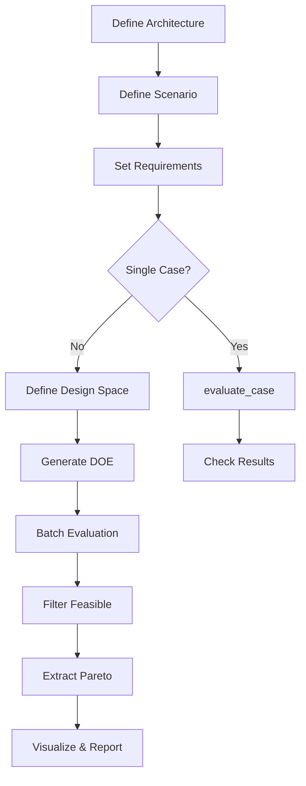

# Getting Started

Welcome to phased-array-systems! This section will help you get up and running quickly.

## Overview

phased-array-systems is a Python package for phased array antenna system design and optimization. It provides:

- **Architecture Configuration**: Define array geometry, RF chain parameters, and cost models
- **Scenario Definition**: Configure communications links or radar detection scenarios
- **Requirements Management**: Define and verify system requirements
- **Trade Studies**: Run Design of Experiments (DOE) with batch evaluation
- **Pareto Analysis**: Extract optimal designs from multi-objective trade spaces
- **Visualization**: Generate plots and reports

## Quick Navigation

| Section | Description |
|---------|-------------|
| [Installation](installation.md) | How to install the package and dependencies |
| [Quickstart](quickstart.md) | Run your first analysis in 5 minutes |
| [Core Concepts](concepts.md) | Key terminology and design patterns |

## Typical Workflow

## Prerequisites

- Python 3.10 or later
- `phased-array-modeling>=1.2.0` (installed automatically)
- Basic familiarity with:
    - Antenna arrays and phased array concepts
    - Communications link budgets or radar equations
    - Python and NumPy/Pandas

## Next Steps

1. [Install the package](installation.md)
2. [Run the quickstart example](quickstart.md)
3. [Learn the core concepts](concepts.md)
4. Explore the [User Guide](../user-guide/index.md) for detailed documentation
