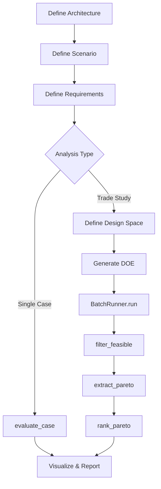

# User Guide

This guide provides detailed documentation for all features of phased-array-systems.

## Overview

The User Guide covers:

| Section | Description |
|---------|-------------|
| [Architecture](architecture.md) | Array, RF chain, and cost configuration |
| [Scenarios](scenarios.md) | Communications and radar scenarios |
| [Requirements](requirements.md) | Defining and verifying requirements |
| [Link Budget](link-budget.md) | Communications link budget modeling |
| [Radar Detection](radar-detection.md) | Radar equation and detection analysis |
| [Trade Studies](trade-studies.md) | DOE generation and batch evaluation |
| [Pareto Analysis](pareto-analysis.md) | Multi-objective optimization |
| [Visualization](visualization.md) | Plotting functions and options |
| [Reports](reports.md) | HTML and Markdown report generation |

## Workflow Summary

A typical analysis follows this workflow:



## Quick Reference

### Architecture Configuration

```python
from phased_array_systems.architecture import (
    Architecture,
    ArrayConfig,
    RFChainConfig,
    CostConfig,
)

arch = Architecture(
    array=ArrayConfig(nx=8, ny=8, dx_lambda=0.5, dy_lambda=0.5),
    rf=RFChainConfig(tx_power_w_per_elem=1.0, pa_efficiency=0.3),
    cost=CostConfig(cost_per_elem_usd=100.0),
)
```

### Scenario Definition

```python
from phased_array_systems.scenarios import CommsLinkScenario

scenario = CommsLinkScenario(
    freq_hz=10e9,
    bandwidth_hz=10e6,
    range_m=100e3,
    required_snr_db=10.0,
)
```

### Requirements

```python
from phased_array_systems.requirements import Requirement, RequirementSet

requirements = RequirementSet(requirements=[
    Requirement("REQ-001", "Min EIRP", "eirp_dbw", ">=", 40.0, severity="must"),
    Requirement("REQ-002", "Max Cost", "cost_usd", "<=", 50000.0, severity="must"),
])
```

### Single Case Evaluation

```python
from phased_array_systems.evaluate import evaluate_case

metrics = evaluate_case(arch, scenario)
report = requirements.verify(metrics)
```

### Trade Study

```python
from phased_array_systems.trades import (
    DesignSpace,
    generate_doe,
    BatchRunner,
    filter_feasible,
    extract_pareto,
)

# Define design space
space = DesignSpace().add_variable("array.nx", "int", low=4, high=16)

# Generate DOE
doe = generate_doe(space, method="lhs", n_samples=100, seed=42)

# Run batch
runner = BatchRunner(scenario, requirements)
results = runner.run(doe)

# Analyze
feasible = filter_feasible(results, requirements)
pareto = extract_pareto(feasible, [("cost_usd", "minimize"), ("eirp_dbw", "maximize")])
```

### Visualization

```python
from phased_array_systems.viz import pareto_plot, scatter_matrix

fig = pareto_plot(results, x="cost_usd", y="eirp_dbw", pareto_front=pareto)
fig = scatter_matrix(feasible, columns=["cost_usd", "eirp_dbw", "link_margin_db"])
```

## Related Documentation

- [Tutorials](../tutorials/index.md) - Step-by-step guides
- [API Reference](../api/index.md) - Complete API documentation
- [Theory](../theory/index.md) - Background equations and theory
