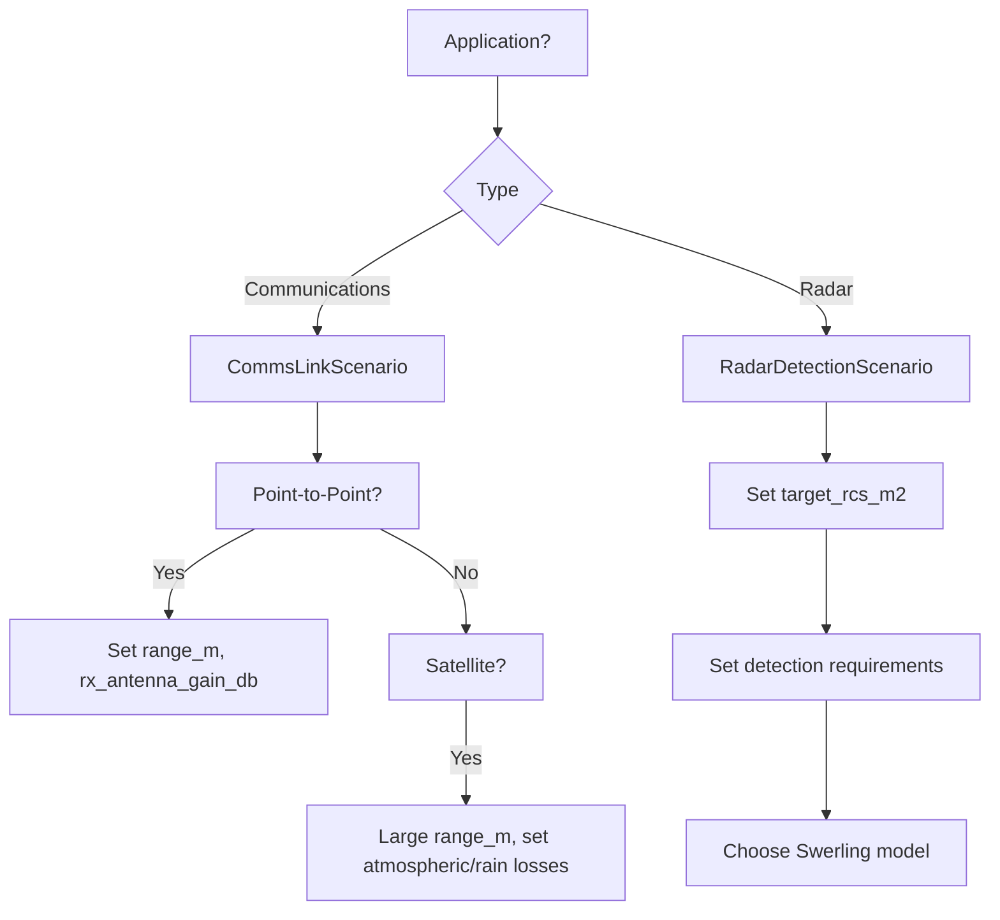

# Scenarios

Scenarios define the operating conditions for analysis. Different scenario types support different applications.

## Overview

phased-array-systems supports two main scenario types:

| Scenario | Class | Application |
|----------|-------|-------------|
| Communications | `CommsLinkScenario` | Link budget analysis |
| Radar | `RadarDetectionScenario` | Detection performance |

All scenarios inherit from `ScenarioBase` and share common parameters.

## CommsLinkScenario

For communications link budget analysis.

### Parameters

| Parameter | Type | Default | Description |
|-----------|------|---------|-------------|
| `freq_hz` | float | Required | Operating frequency (Hz) |
| `bandwidth_hz` | float | Required | Signal bandwidth (Hz) |
| `range_m` | float | Required | Link range (m) |
| `required_snr_db` | float | Required | Required SNR for demod (dB) |
| `scan_angle_deg` | float | `0.0` | Beam scan angle (degrees) |
| `rx_antenna_gain_db` | float | `None` | RX antenna gain (dB) |
| `rx_noise_temp_k` | float | `290.0` | RX noise temperature (K) |
| `path_loss_model` | str | `"fspl"` | Propagation model |
| `atmospheric_loss_db` | float | `0.0` | Atmospheric loss (dB) |
| `rain_loss_db` | float | `0.0` | Rain fade margin (dB) |
| `polarization_loss_db` | float | `0.0` | Polarization loss (dB) |

### Example

```python
from phased_array_systems.scenarios import CommsLinkScenario

# Point-to-point terrestrial link
scenario = CommsLinkScenario(
    freq_hz=10e9,              # 10 GHz (X-band)
    bandwidth_hz=10e6,         # 10 MHz
    range_m=50e3,              # 50 km
    required_snr_db=12.0,      # 12 dB for 16-QAM
    scan_angle_deg=15.0,       # 15° off boresight
    rx_antenna_gain_db=30.0,   # 30 dBi receive antenna
    rx_noise_temp_k=300.0,     # System noise temperature
    atmospheric_loss_db=0.5,   # Atmospheric absorption
    rain_loss_db=3.0,          # Rain fade margin
)
```

### Satellite Link Example

```python
# Geostationary satellite downlink
geo_scenario = CommsLinkScenario(
    freq_hz=12e9,              # Ku-band
    bandwidth_hz=36e6,         # 36 MHz transponder
    range_m=36000e3,           # GEO distance
    required_snr_db=8.0,       # QPSK
    scan_angle_deg=0.0,        # Boresight
    rx_antenna_gain_db=40.0,   # Large ground station
    rx_noise_temp_k=100.0,     # Cooled LNA
    atmospheric_loss_db=0.3,
    rain_loss_db=5.0,          # High rain margin
)
```

### Path Loss Models

Currently supported:

| Model | Description |
|-------|-------------|
| `"fspl"` | Free Space Path Loss |

Free space path loss:

\\[
L_{FSPL} = 20 \log_{10}(4\pi d f / c)
\\]

### Extra Losses

Total extra loss is computed automatically:

```python
# Available as property
total_loss = scenario.total_extra_loss_db
# = atmospheric_loss_db + rain_loss_db + polarization_loss_db
```

## RadarDetectionScenario

For radar detection performance analysis.

### Parameters

| Parameter | Type | Default | Description |
|-----------|------|---------|-------------|
| `freq_hz` | float | Required | Operating frequency (Hz) |
| `target_rcs_m2` | float | Required | Target RCS (m²) |
| `range_m` | float | Required | Target range (m) |
| `required_pd` | float | `0.9` | Required detection probability |
| `pfa` | float | `1e-6` | False alarm probability |
| `pulse_width_s` | float | Required | Pulse width (s) |
| `prf_hz` | float | Required | Pulse repetition frequency (Hz) |
| `n_pulses` | int | `1` | Pulses to integrate |
| `integration_type` | str | `"coherent"` | Integration type |
| `swerling_model` | int | `1` | Target fluctuation model |
| `scan_angle_deg` | float | `0.0` | Beam scan angle (degrees) |
| `system_loss_db` | float | `0.0` | System losses (dB) |

### Example

```python
from phased_array_systems.scenarios import RadarDetectionScenario

scenario = RadarDetectionScenario(
    freq_hz=10e9,              # X-band
    target_rcs_m2=1.0,         # 1 m² target
    range_m=100e3,             # 100 km
    required_pd=0.9,           # 90% detection probability
    pfa=1e-6,                  # 10⁻⁶ false alarm rate
    pulse_width_s=10e-6,       # 10 μs pulse
    prf_hz=1000,               # 1 kHz PRF
    n_pulses=10,               # Integrate 10 pulses
    integration_type="coherent",
    swerling_model=1,          # Swerling 1 target
)
```

### Swerling Models

| Model | Description | Target Type |
|-------|-------------|-------------|
| 0 | Non-fluctuating | Steady target |
| 1 | Scan-to-scan decorrelation | Many scatterers, slow |
| 2 | Pulse-to-pulse decorrelation | Many scatterers, fast |
| 3 | Scan-to-scan, dominant scatterer | Large + small, slow |
| 4 | Pulse-to-pulse, dominant scatterer | Large + small, fast |

### Integration Types

| Type | Description | Gain |
|------|-------------|------|
| `"coherent"` | Phase-coherent integration | \\(N\\) (linear) |
| `"noncoherent"` | Magnitude-only integration | \\(\sqrt{N}\\) (approx) |

## ScenarioBase

Both scenario types inherit common parameters:

### Parameters

| Parameter | Type | Default | Description |
|-----------|------|---------|-------------|
| `freq_hz` | float | Required | Operating frequency (Hz) |
| `name` | str | `None` | Optional scenario name |

### Properties

| Property | Returns | Description |
|----------|---------|-------------|
| `wavelength_m` | float | Wavelength (c/f) |

```python
scenario = CommsLinkScenario(freq_hz=10e9, ...)
print(f"Wavelength: {scenario.wavelength_m * 100:.2f} cm")  # 3.00 cm
```

## Typical Parameter Values

### Frequency Bands

| Band | Frequency | Typical Use |
|------|-----------|-------------|
| L | 1-2 GHz | Long-range radar, satcom |
| S | 2-4 GHz | Weather radar, ATC |
| C | 4-8 GHz | Satcom, weather |
| X | 8-12 GHz | Military radar, satcom |
| Ku | 12-18 GHz | DBS, satcom |
| Ka | 26-40 GHz | High-throughput satcom |

### Required SNR by Modulation

| Modulation | Typical SNR |
|------------|-------------|
| BPSK | 6-10 dB |
| QPSK | 8-12 dB |
| 8PSK | 12-15 dB |
| 16-QAM | 14-18 dB |
| 64-QAM | 20-24 dB |

### Typical Detection Requirements

| Application | Pd | Pfa |
|-------------|----|----|
| Air traffic control | 0.95 | 10⁻⁷ |
| Weather radar | 0.9 | 10⁻⁶ |
| Military search | 0.8-0.9 | 10⁻⁶ |
| Tracking | 0.99 | 10⁻⁴ |

## YAML Configuration

Scenarios can be defined in YAML:

```yaml
# Communications scenario
scenario:
  type: comms
  freq_hz: 10.0e9
  bandwidth_hz: 10.0e6
  range_m: 100.0e3
  required_snr_db: 10.0
  scan_angle_deg: 0.0
  rx_noise_temp_k: 290.0
  atmospheric_loss_db: 0.5
```

```yaml
# Radar scenario
scenario:
  type: radar
  freq_hz: 10.0e9
  target_rcs_m2: 1.0
  range_m: 100.0e3
  required_pd: 0.9
  pfa: 1.0e-6
  pulse_width_s: 10.0e-6
  prf_hz: 1000
  n_pulses: 10
  swerling_model: 1
```

Load with:

```python
from phased_array_systems.io import load_config

config = load_config("config.yaml")
scenario = config.get_scenario()
```

## Scenario Selection Guide



## See Also

- [Link Budget Modeling](link-budget.md) - Communications link analysis
- [Radar Detection](radar-detection.md) - Radar performance analysis
- [API Reference](../api/scenarios.md) - Complete API documentation
